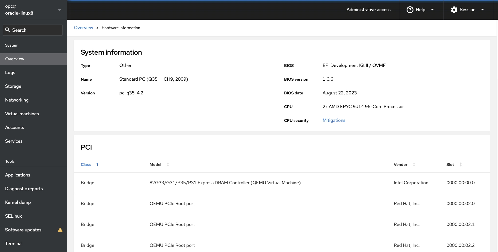
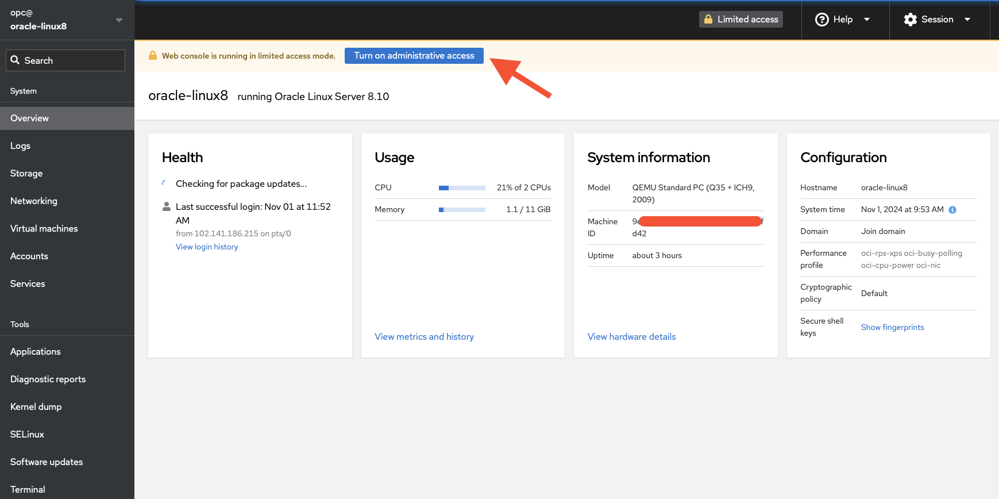
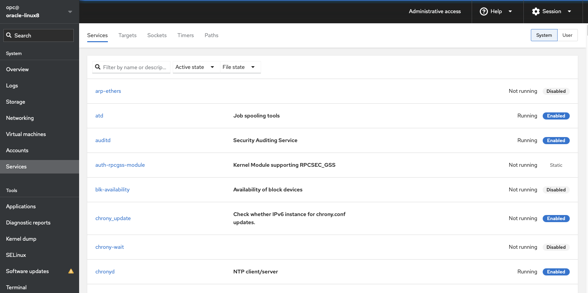
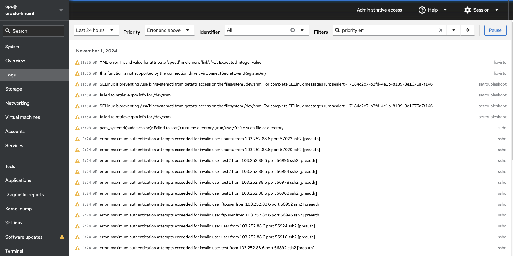
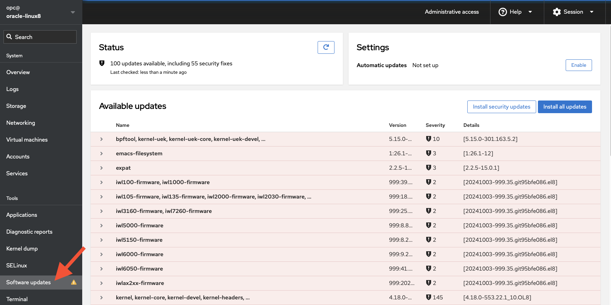

# Cockpit – Web console to manage Oracle Linux
## System administration graphical web console for Oracle Linux

Cockpit web console:
[Getting started with Cockpit Web Console](https://docs.oracle.com/en/operating-systems/oracle-linux/cockpit/cockpit-install.html) The Cockpit web console is an Oracle Linux server administration tool designed for managing and monitoring Linux systems both locally and remotely. The graphical web console for management and administration is user-friendly and accessible to administrators at all levels of experience with Linux. The Cockpit installation package arrives out of the box and ready for use in most Oracle Linux distributions.

Cockpit provides Linux administration features such as System overview, Log details, Networking details, User account details, Software update features, integration with KVM to create Virtual machines.

| Cockpit featues              |  |  |
| :---------------- | :------: | :----: |
| System overview  |   Log details 	|  User detail |
| Software updates | Storage detail    	|   Diagnostic reports |

## Installation of Cockpit

[Installation guide for Oracle Linux 7](https://docs.oracle.com/en/operating-systems/oracle-linux/cockpit/)

Works the same as [Centos 7](http://unix-linux-server.blogspot.com/2015/01/install-cockpit-on-centos-7.html)

    sudo yum install cockpit cockpit-machines-overt
    sudo firewall-cmd --add-service=cockpit --permanent
    sudo firewall-cmd –reload
    sudo firewall-cmd --list-services
    Edit file /usr/lib/systemd/system/cockpit.service and modify ExecStart line to look like this.
    ExecStart=/usr/libexec/cockpit-ws --no-tls
    

[Installation guide for Oracle Linux 8 and 9](https://docs.oracle.com/en/operating-systems/oracle-linux/cockpit/)
		
    sudo dnf install -y cockpit cockpit-machines
    sudo systemctl enable --now cockpit.socket
    sudo systemctl status cockpit.socket
    Enable security list for port 9090 on OCI
    On laptop, create an SSH tunnel:  ssh -i private-key -L 9090:localhost:9090 opc@ip_address_of_instance
    Open browser http://localhost:9090
    Login using opc credentials and tick “Reuse my password for privileged tasks”
 
[Installation guide for Ubuntu](https://www.techrepublic.com/article/install-cockpit-ubuntu-better-server/)
		
    sudo apt update;  sudo apt upgrade
    sudo apt install cockpit
    sudo systemctl enable --now cockpit.socket
    sudo ufw allow 9090
    Provide ubuntu user new password: sudo passwd ubuntu
    Create tunnel on your local machine: ssh -i private-key -L 9090:localhost:9090 ubuntu@ip-address-o-ubuntu-server
    Open browser http://localhost:9090

## The pictures below show cockpit utility

<pre>
System overview using Cockpit:

Cockpit login:

Operating system list of services:

Log viewer:

Software updates:

</pre>

<!--
comment
-->

## Resources

- [Getting started with Cockpit](https://docs.oracle.com/en/operating-systems/oracle-linux/cockpit/cockpit-install.html)
- [Installation guide for Oracle Linux](https://docs.oracle.com/en/learn/ol-kvm/#setup-cockpit-web-console-to-manage-kvm-on-oracle-linux)
- [Installation video](https://www.youtube.com/watch?v=L9fMWCRcqIE)
- [Further reading](https://cockpit-project.org/running.html)

                                 
                                 
                                                    ---oOo---
