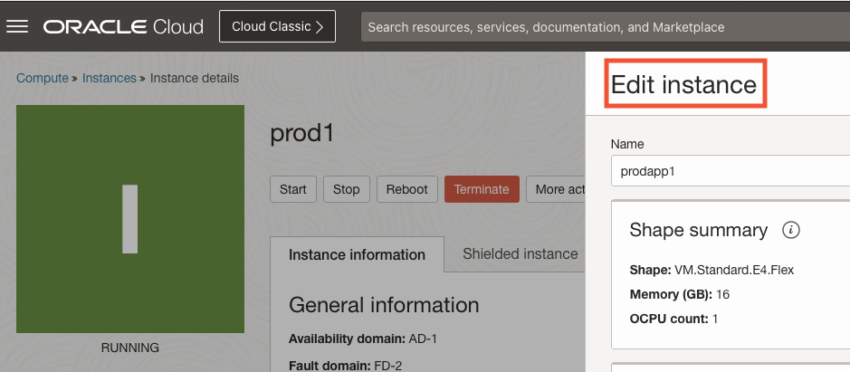
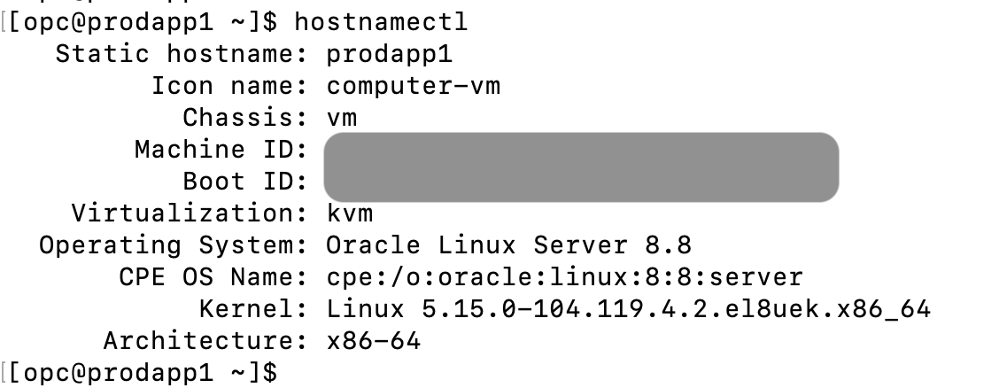

## Change hostname of OCI Compute Instance Virtual Machine

### Overview
This section explains how to change the hostname of a Virtual Machine (VM) created on Oracle Cloud Infrastructure (OCI). When a Virtual Machine (VM) is created on OCI, the hostname will be the same name as the 'Compute Instance name'.

### How to change hostname of VM on OCI

In this example the current hostname is set to: **prod1**

We want to change the hostname to: **prodapp1**

If the OCI Compute Instance VM is running Oracle Linux 7 and later, do the following:

1: Display current hostname using OCI console:
 

 <!--  -->

Display current hostname using terminal:
 $ hostnamectl

2: Update the /etc/hostname file with the new hostname: prodapp1

  $ sudo hostnamectl set-hostname prodapp1

3: Edit the oci configuration file for hostnames as given below to update the needed value to 2.
  $ sudo vi /etc/oci-hostname.conf
    PRESERVE_HOSTINFO=2
    save the changes.

<pre>
4: Edit the FQDN from OCI console GUI
go to compute instances on the OCI Console
--> select the instance
--> scroll down
--> at the left bottom corner select "Attached VNIC" under the Resources heading
--> edit appropriate VNIC
--> change hostname to update FQDN
--> update VNIC
--> Save changes
--> More action -> Edit shape -> Change instance name to prodapp1
</pre>

5: Reboot the instance to apply the new hostname. Use OCI Console to reboot the Compute instance:
$ sudo init 6

### References:
  [(1) How to change hostname of VM on OCI (Doc ID 2325469.1)](https://support.oracle.com/knowledge/Oracle%20Cloud/2325469_1.html)

# License
Copyright (c) 2023 Oracle and/or its affiliates.
Licensed under the Universal Permissive License (UPL), Version 1.0.
See [LICENSE](https://github.com/oracle-devrel/technology-engineering/blob/folder-structure/LICENSE) for more details.

--September 2023
