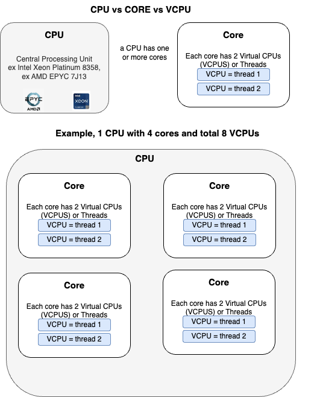
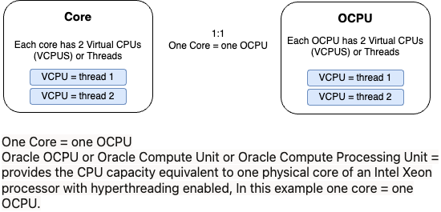

## What is Oracle OCPU, and VCPU?

Overview: 
Oracle OCPU or Oracle Compute Unit or Oracle Compute Processing Unit = provides the CPU capacity equivalent to one physical core of an Intel Xeon processor with hyperthreading enabled, In this example one core = one OCPU.  [(1) 

This picture explains Core vs VCPU:

This picture explains OCPU:
An OCPU is equivalent to once core.

References:
  
[(1) OCPU definition:](https://docs.oracle.com/en/cloud/get-started/subscriptions-cloud/ocpib/key-billing-terminology.html#GUID-3D3AF4EB-98AC-437E-80E9-956B8577AECA) https://docs.oracle.com/en/cloud/get-started/subscriptions-cloud/ocpib/key-billing-terminology.html#GUID-3D3AF4EB-98AC-437E-80E9-956B8577AECA

[Oracle OCPU description:](https://docs.oracle.com/en/cloud/get-started/subscriptions-cloud/ocpib/key-billing-terminology.html) https://docs.oracle.com/en/cloud/get-started/subscriptions-cloud/ocpib/key-billing-terminology.html 

[Oracle OCPU Pricing information:](https://blogs.oracle.com/cloud-infrastructure/post/vcpu-and-ocpu-pricing-information)https://blogs.oracle.com/cloud-infrastructure/post/vcpu-and-ocpu-pricing-information

[Video:](https://www.youtube.com/watch?v=zZb5Y8ea2Z4)

---